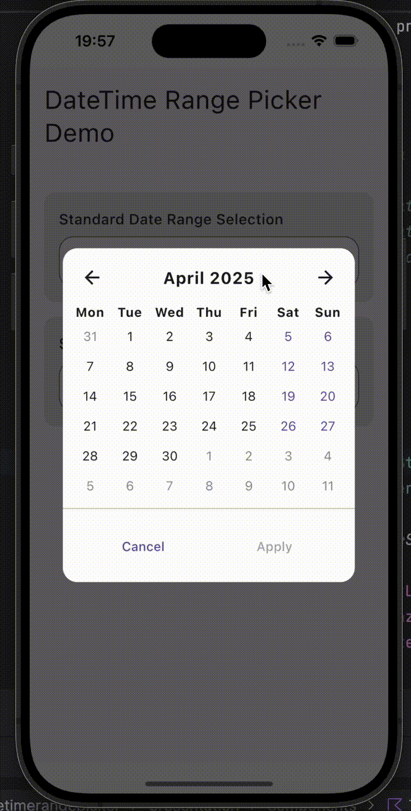

# DateTime Range Picker for Compose Multiplatform

<p align="center">
  
</p>

<p align="center">
  <a href="https://opensource.org/licenses/MIT"></a>
  <a href="#"></a>
  <a href="#"></a>
  <a href="#"></a>
</p>

## 📖 About

**DateTime Range Picker** is a modern, customizable date and time range selection component built with Compose Multiplatform. Perfect for booking systems, event scheduling, or any application requiring date range selection with precise time picking capabilities.

## ✨ Features

- **📆 Interactive Calendar View**  
  Intuitive monthly calendar with smooth animations and visual date range indication.

- **🕒 Time Selection**  
  Elegant wheel-based time picker for precise hour and minute selection.

- **📱 Responsive Design**  
  Works seamlessly across different screen sizes and orientations.

- **🎨 Customizable**  
  Adapt to your app's theme with customizable colors and styles.

- **🔄 Single Date or Range Selection**  
  Support for both single date/time picking and date/time range selection.

- **🌈 Animated Transitions**  
  Smooth animations for state changes and transitions between views.

## 📱 Screenshots

<p align="center">
  
  
</p>

## 📋 Usage

### Basic Implementation

1. **Add the DateTimeRangeField to your composable**

```kotlin
@Composable
fun App() {
    val state = rememberDateRangePickerState()
    
    DateTimeRangeField(
        modifier = Modifier.fillMaxWidth(),
        state = state,
        onRangeSelected = { (start, end) ->
            // Handle the selected date range
            println("Selected range: $start to $end")
        }
    )
}
```

2. **Single date selection**

```kotlin
val state = rememberDateRangePickerState(singleSelection = true)

DateTimeRangeField(
    state = state,
    onRangeSelected = { (selectedDate, _) ->
        // Handle the selected date
        println("Selected date: $selectedDate")
    }
)
```

## 🎨 Customization

### DateRangePickerState Properties

The component state can be customized when created:

```kotlin
val state = rememberDateRangePickerState(
    initialYear = 2024,                // Initial year to display
    initialMonth = Month.JULY,         // Initial month to display
    singleSelection = false            // Range or single selection mode
)
```

### TimePicker Example

The time picker is automatically integrated but can be used separately:

```kotlin
var showTimePicker by remember { mutableStateOf<LocalDateTime?>(null) }

showTimePicker?.let { dateTime ->
    TimePicker(
        initialDateTime = dateTime,
        onDone = { newDateTime ->
            // Handle the selected time
            showTimePicker = null
        }
    )
}
```

## 🧩 Component Architecture

The project consists of several key components:

1. **DateTimeRangeField**: Main entry point component that displays the field and handles dialog display.

2. **DateRangePickerState**: State class that manages selection state and provides formatting utilities.

3. **DateTimePicker**: Calendar view component that displays the month grid and allows date selection.

4. **TimePicker**: Wheel-based time selection component with hour and minute wheels.

5. **VerticalWheelPicker**: Reusable wheel picker component with physics-based scrolling.

## 📊 Advanced Usage

### Custom Date Formatting

You can access and format the selected dates from the state:

```kotlin
Text(
    text = "Selected dates: ${state.formattedDates ?: "None"}",
    style = MaterialTheme.typography.bodyMedium
)
```

### Programmatic Control

The picker state offers methods for programmatic control:

```kotlin
// Navigate between months
state.navigateToNextMonth()
state.navigateToPreviousMonth()

// Reset the selection
state.resetSelection()

// Get the current selection
val (startDate, endDate) = state.selectedRange
```

## 🔄 Integration with Existing Components

The DateTime Range Picker can be easily integrated with other Compose components:

```kotlin
Column(
    modifier = Modifier.padding(16.dp),
    verticalArrangement = Arrangement.spacedBy(16.dp)
) {
    Text(
        text = "Select Reservation Period",
        style = MaterialTheme.typography.titleLarge,
        fontWeight = FontWeight.Bold
    )
    
    DateTimeRangeField(
        modifier = Modifier.fillMaxWidth(),
        state = dateRangeState
    )
    
    // Custom display of selected dates
    dateRangeState.selectedRange.first?.let { startDateTime ->
        Text("Check-in: ${formatDateTime(startDateTime)}")
    }
    
    dateRangeState.selectedRange.second?.let { endDateTime ->
        Text("Check-out: ${formatDateTime(endDateTime)}")
    }
    
    Button(
        onClick = { /* Handle booking */ },
        enabled = dateRangeState.selectedRange.first != null
    ) {
        Text("Book Now")
    }
}
```

## 📱 Platform Support

This component is implemented with Compose Multiplatform and should work on:

- ✅ Android
- ✅ iOS
- ✅ Desktop (Windows, macOS, Linux)

## 🛠️ Project Structure

```
com.metoly.datetimerangepicker/
├── model/
│   ├── DateRangePickerState.kt       # State management for date selection
│   ├── DateSelectionHandler.kt       # Handler for date selection logic
│   └── VerticalWheelPicker.kt        # Wheel picker component
├── presentation/
│   └── components/
│       ├── DateTimeRangeField.kt     # Main component with field and dialog
│       └── TimePicker.kt             # Time selection component
```

## 🧪 How to Use This Project

1. Clone the repository
2. Import the project into your IDE
3. Add the components to your Compose Multiplatform project
4. Customize as needed for your application
